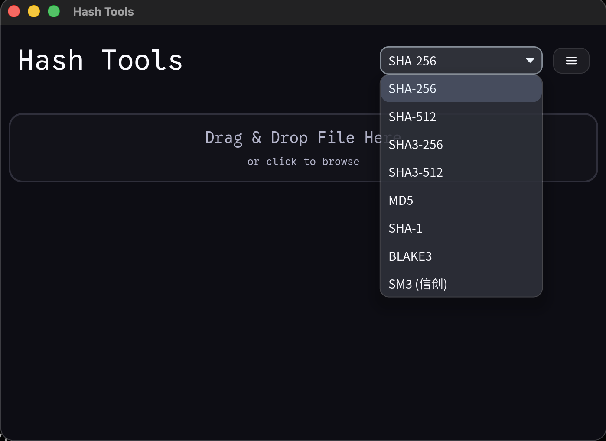

# Hash Tools

<div align="center">



**跨平台文件哈希计算器 + PDF 国密签名验证工具**

*解决 Adobe Acrobat 无法验证 SM3withSM2 签名的行业痛点*

[](https://www.rust-lang.org/)
[](LICENSE)
[](#installation)

[📖 产品介绍](docs/product_overview.html) • [⚙️ 技术文档](docs/technical_implementation.html) • [📥 下载](../../releases)

</div>

---

## ✨ 核心功能

### 🔐 国密签名验证 (SM3withSM2)

- **完整验证流程**：messageDigest 哈希比对 + SM2 椭圆曲线签名验证
- **自动算法检测**：从 PKCS#7 OID 识别签名算法
- **BER 编码支持**：兼容 Apple Developer 等使用 BER 编码的证书
- **篡改检测**：ByteRange 完整性验证，任何修改都会被标记

### 📊 多算法哈希计算

| 算法 | 输出长度 | 说明 |
|------|----------|------|
| **SM3** | 256-bit | 中国国家密码标准 |
| SHA-256 | 256-bit | 推荐使用 |
| SHA-512 | 512-bit | 高安全性 |
| SHA3-256/512 | 256/512-bit | NIST 最新标准 |
| SHA-1 | 160-bit | 仅兼容用途 |
| MD5 | 128-bit | 仅兼容用途 |
| BLAKE3 | 256-bit | 高性能 |

### 🎨 现代 UI

- 深色玻璃主题
- 完整中文 (CJK) 支持
- 高 DPI / Retina 显示支持
- 拖放文件操作
- 一键复制哈希值

---

## 🚀 快速开始

### 安装

**预编译二进制**：从 [Releases](../../releases) 下载

**从源码构建**：

```bash
git clone https://github.com/your-username/hash_tools.git
cd hash_tools
cargo build --release
./target/release/hash_tools
```

### 验证 PDF 签名

1. 启动 Hash Tools
2. 拖入 PDF 文件
3. 展开 "PDF Signature Hash" 部分
4. 查看验证结果：
   - `[OK] Valid` - 签名完全有效
   - `[X] Invalid` - 签名无效或文档被篡改
   - `[~] Hash OK` - 哈希匹配但密码学验证未通过

### 导出诊断报告

点击 **Export** 按钮，生成 `.diagnostics.html` 文件，包含：
- 签名者信息和证书详情
- 完整哈希值对比
- OID 和算法信息
- 验证结果

---

## 🏗️ 项目结构

```
hash_tools/
├── src/
│   ├── main.rs              # GUI 应用入口
│   ├── hash_logic.rs        # 哈希计算逻辑
│   ├── pdf_signature.rs     # PDF 签名提取与验证
│   ├── style.rs             # UI 样式
│   └── icons.rs             # SVG 图标
├── templates/
│   └── diagnostics_report.html  # HTML 导出模板
├── docs/
│   ├── product_overview.html    # 产品介绍 (管理层)
│   └── technical_implementation.html  # 技术文档 (开发者)
├── assets/                  # 应用图标
└── tests/                   # 仅本地测试样本（已忽略，不随仓库分发）
```

---

## 🔧 技术实现

### SM3withSM2 验证流程

```
1. 读取 ByteRange 内容
2. 计算 SM3(ByteRange)
3. 对比 PKCS#7 中的 messageDigest
4. 提取 SM2 公钥
5. 执行 SM2 签名验证
6. 返回验证结果
```

### 关键依赖

| Crate | 用途 |
|-------|------|
| `lopdf` | PDF 文档解析 |
| `cms` | PKCS#7/CMS 解析 |
| `libsm` | SM2/SM3 国密算法 |
| `asn1-rs` | ASN.1 BER 解析 |
| `iced` | 跨平台 GUI |
| `tera` | HTML 模板引擎 |

详细技术文档：[technical_implementation.html](docs/technical_implementation.html)

---

## ❓ 常见问题

### 为什么 Adobe Acrobat 无法验证国密签名？

Adobe Acrobat 依赖操作系统的加密服务提供程序 (CSP)。Windows/macOS 原生不包含 SM2/SM3 支持，需要安装第三方驱动。

**Hash Tools 的优势**：内置 `libsm` 实现，无需安装任何驱动或 CSP。

### 什么是 BER 编码？

- **DER** (Distinguished Encoding Rules)：严格编码，确定长度
- **BER** (Basic Encoding Rules)：宽松编码，允许不定长度

Apple Developer 等证书使用 BER，Hash Tools 支持两种编码。

### 如何验证工具的正确性？

1. 使用已知有效的签名 PDF 测试
2. 修改 PDF 内容后重新验证，应显示 Invalid
3. 对比 messageDigest 与计算哈希

---

## 📜 许可证

本项目采用 [MIT License](LICENSE)。

## 🤝 贡献

欢迎提交 Issue 和 Pull Request！

### 提交前的数据检查

此仓库公开发布。不要提交客户 PDF/OFD、签章样本、个人证书、私钥、
PFX/P12、导出的诊断报告或环境凭据。相关文件和本地样本目录已加入
`.gitignore`；不要使用 `git add -f` 绕过这些规则。HTML 报告模板可以提交，
实际导出的 `.diagnostics.html` 不可以。

`.gitignore` 不会清除已提交的数据。推送前还需检查暂存区及待推送提交的
完整可达历史；从当前目录删除文件或追加删除提交，都不能移除历史中的文件。
云端环境只使用代码生成的合成测试数据，不上传本地样本目录。

本次同步方式与验证结果见 [云端升级前基线记录](docs/BASELINE-20260826.md)。

## 🙏 致谢

- [iced](https://github.com/iced-rs/iced) - Rust 跨平台 GUI 框架
- [libsm](https://github.com/nickel-org/libsm) - SM2/SM3 实现
- [RustCrypto](https://github.com/RustCrypto) - 加密算法库
